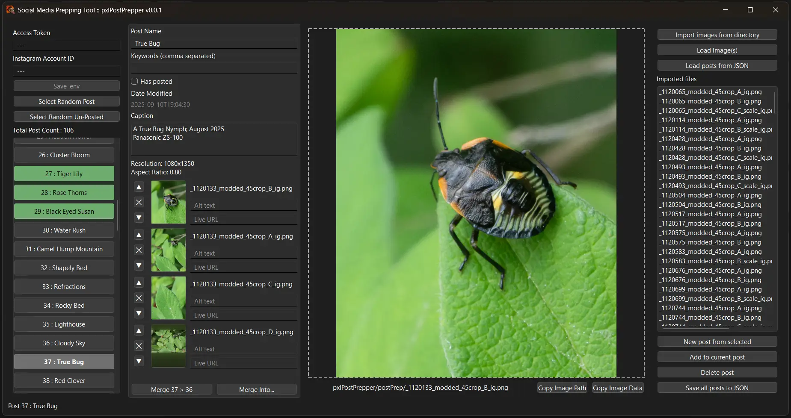

This project is a work-in-progress.
 The steps below are only partially correct.
 Since the auto-posting side still isn't working.

### Current Functionality

 - Load Directories or multiple selected images to load as individual posts
 - Combine posts as needed
 - Add Comment, Alt Test, Live URL data per Post and Media
 - Save & Load your project as a JSON file to your computer
 - Mark `Has Posted` to colored a post Green
 - If you are randomly posting, like me, hit `Select Random Post` or `Select Random Un-Posted`

 
 
 - Find a Windows build in `Releases`
 - To run from Terminal / Command Prompt, you'll need PyQT6
 - Written in Python 3.10.6

### Pyinstaller
If you feel like building the exe, using `pyinstaller` -
 `pyinstaller --onefile --windowed --icon=Icon.ico --add-data="Icon.ico;."  pxlPostPrepper.py`

### Work-In-Progress
I'm leaving the info below for when the auto-posting scripts work

XXX

What you'll need for this to work -
  - An Intagram account set to 'Professional'; your pro. account can be Creative or Business
 &nbsp;&nbsp; | Simply set your Personal account to Professional for free from your account settings in instagram.
  - Create a [Meta App for Instagram](https://developers.facebook.com/docs/instagram-platform/create-an-instagram-app)
  - Get your developer & app credentials
  - Rename or duplicate `.env_base` to `.env`
  - In the `.env` update the entries with your credentials.
  - Right click in the browser folder for `pxlAutoPoster` and click `Open in Terminal`
  - Double-click `setup.bat` -or- run `pip install requirements.txt` from the repo's root.
  - You should now be ready to double click the `pxlAutoPoster.py` file, or run `python pxlAutoPoster.py`

 
  In the tool, make new posts in the right side bar, select items for the post from the left bar, altering any scaling or image cropping as needed.

When Saving, your posts will be saved to the location you set in the `.env` file.
 In the future, I'll set it up to read multiple accounts, but for now, I only need this automated for one account.
 So that's what you'll get too haha.